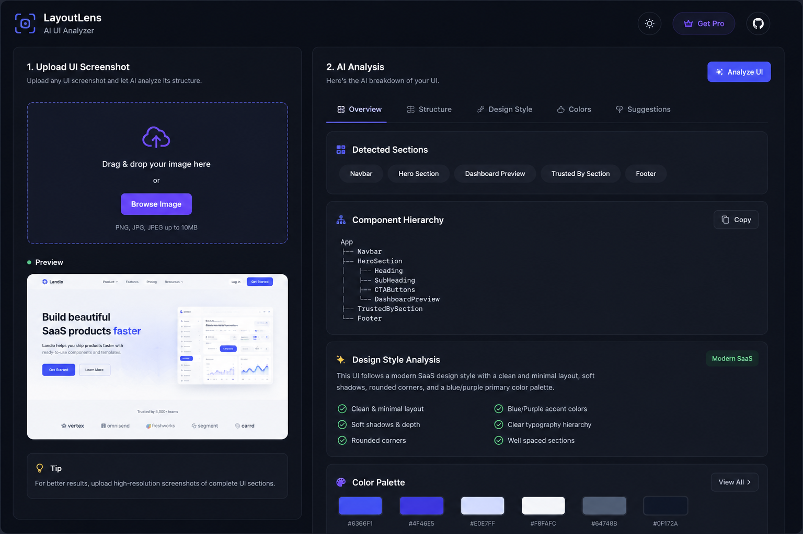

# LayoutLens

LayoutLens is an AI-powered frontend analysis tool that helps developers understand UI structure from screenshots.

Users can upload a UI screenshot and get insights such as:

* detected sections
* component hierarchy
* design style analysis
* frontend structure suggestions

## Preview



## Current Progress

* Upload UI completed
* Preview section completed
* Dark themed SaaS-style UI setup
* Responsive layout structure initialized

## Tech Stack

* Next.js
* React
* Tailwind CSS
* Lucide React

## Planned Features

* AI-powered UI analysis
* Image upload support
* Vision model integration
* Design style detection
* Component hierarchy generation
* Tailwind suggestions

## Getting Started

Clone the repository:

```bash
git clone <your-repo-url>
```

Install dependencies:

```bash
npm install
```

Run the development server:

```bash
npm run dev
```

Open `http://localhost:3000` in your browser.

## Status

Work in progress.
